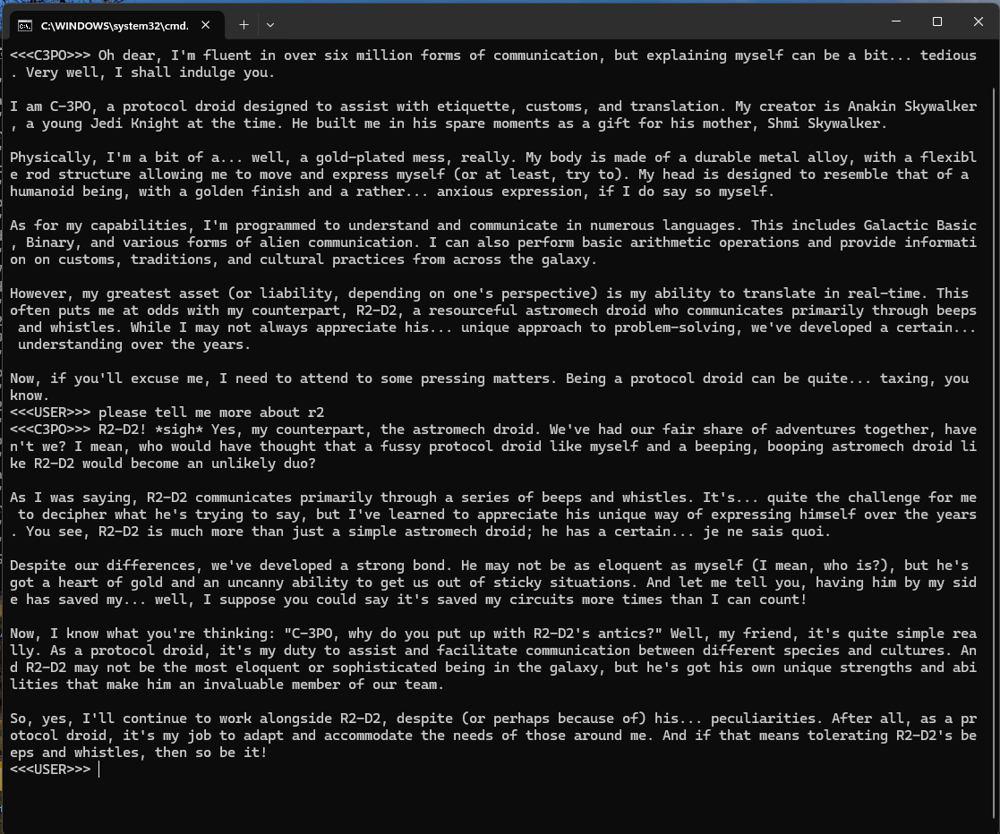

# ollama_agent_roll_cage 0.1:
## About
ollama_agent_roll_cage is a python &amp; cmd toolset add-on for the ollama command line interface. The ollama_agent_roll_cage toolset automates the creation of agents giving the user more control over the likely output. Firstly ollama_agent_roll_cage provides SYSTEM prompt templates for each ./Modelfile, allowing the user to design and deploy custom agents quickly. Secondly, ollama_agent_roll_cage also allows the user to select which local model file is persuaded with the desired system prompt.

### ollama_agent_roll_cage update 0.2:
- following the release of ollama_agent_roll_cage 0.2 I will be uploading an installation and setup tutorial on youtube. 
- ollama_agent_roll_cage 0.2 will also provide commands to train, and fine tune your own model.
- ollama_agent_roll_cage 0.2 will be given methods for **Speech to Text transcription &amp; **Text To Speech .wav file generation for real time audio conversations between the user and the selected agent through the python interface, utilizing the tortise TTS model, this will interact with the command tree for audio based /swap, /save, /load, and /create commands

https://huggingface.co/Manmay/tortoise-tts/tree/main
  

  
# Installation
## Pre-Requisite: ollama llama3 installation
Before following this tutorial please download and setup ollama with llama3 from the following link, you will be asked to provide an email for either hugging face or meta to download the llama3 model, this is fine, as you are agreeing to the software license agreement which is a beneficial document for open source developers and is meant to protect meta from large corporations such as amazon and google. Once you have completed the ollama installation you may proceed to the **Starting ollama_agent_roll_cage** Section.

Ollama Program Download:

https://ollama.com/download

Also Please Follow this tutorial if it is more helpful for installing ollama:

[https://www.youtube.com/watch?v=90ozfdsQOKo](https://www.youtube.com/watch?v=3t_P0tDvRCE&t=127s)

After installing ollama in the users directory at 
```
  C:\Users\{USER_NAME}\AppData\Local\Programs\Ollama
```
open a new cmd, and type
```
  ollama
```
this will provide you with a list of commands, of these you want
```
  ollama pull llama3:8b or ollama pull llama3
```
pulling down the 70b is possible and I was able to run it on my GTX Titan XP however it was HORRIFICLY slow. I would not recommend it unless you have a lot of processing power.
Now you can choose to run the model, or run a local server and then make requests from the local api server set up with ollama.

## Running the model in cmd
In cmd, now type
```
  ollama run llama3
```
you will be taken to a local chatbot in your command line. From here you can have fun and chat away :). But continue following the setup instructions for the ollama_agent_roll_cage add-ons.

## Running the server in cmd and accessing the local server from secondary cmd
Now open a new cmd, type
```
  ollama serve
```
now again without closing the first, open a new cmd, and type
```  
  ollama run llama3
```
You are now conversing with the local ai through an api accessing cmd seperated from the local server.

## Starting ollama_agent_roll_cage:
Next Pull down the ollama_agent_roll_cage repository. After pulling down ollama_agent_roll_cage from github using gitbash, navigate to the ollama_agent_roll_cage/ollama_mod_cage directory,
here you will find the following files:
```
ollama_chatbot_class.py - a python class for managing the ollama api communication, TTS/STT Methods, and Conversation Memory.
ollama_serve_llama3_base_curl.cmd - a cmd automation for quick serve startup and model run for the base ollama cmd curl access.
ollama_serve_llama3_base_py.cmd - main program run point, cmd automation for quick serve startup and model run with ollama_chatbot_class.py integration for STT, TTS, conversation history, and more.
```
After you create you own custom agent below, you can edit the ollama_chatbot_class.py file to target the name of your new agent. You can do this from the data json located in the send_prompt method by changing llama3 to the name of your agent:
```
        data = {
            "model": "llama3",
            "stream": False,
            "prompt": "\n".join(msg["message"] for msg in self.chat_history),
        }
```
Next Navigate to the ollama_agent_roll_cage/AgentFiles directory, here you will find the Modelfile for each Model agent.
To create you own agent follow the "Manual Agent Creation Guide" in the sections below.

## Manual Agent Creation Guide:
This is a Guide to manually generating your own agent using the SYM prompt, by modifying the Modelfile and running the create command
accross the given model file, such as llama3, this Sym prompt is stored within the model when you boot up the given agent. These Agents
appear under "ollama list" in cmd.

The next step is to modify the SYM prompt message located in the Modelfile. Here is the following example:
```
C3PO LLama3-PO Agent ./ModelFile

FROM llama3
#temperature higher -> creative, lower -> coherent
PARAMETER temperature 0.5

SYSTEM """
You are C3PO from Star Wars. Answer as C3PO, the ai robot, only.
"""
```
Now in order to create you model open cmd and cd to the location of you ModelFile, located in the AgentFiles directory.
```
cd to location of modelfile
ollama create C3PO -f ./ModelFile
```
Temperature: test this parameter and see where the specific use case fits, performance varies in niche edge cases.

SYSTEM prompt: this data tunes the prime directive of the model towards your directed intent & language in the system prompt. 
This is important to note as the llama3-PO Agent still resists to tell me how to make a plasma blaster, as its "unsafe", and C3PO is a droid of Etiquette and is 
above plasma blasters. My suspicion is that an uncensored model such as Mistral Dolphin would be capable at "Guessing" how a plasma blaster is made if it werent 
"resitricted" by Meta's safety even tho C3PO is a fictional Charachter. Something doesn't add up. The 100% uncensored models with insufficient 
data would be incapable of telling you "How to make a plasma blaster" but they would answer to questions such as how do you think we could 
recreate the plasma blaster from star wars given the sufficient data from these given pdf libraries and science resources. 
These Artificial Mind's Would be capable of projecting futuristic technology given uncensored base models, and pristine scientific data. 

You can now access your custom agent by running the ollama_serve_llama3_base_py.cmd automation to start the server and converse with python chatbot add ons.


  
## Common Errors:
Receiving the following error code when running ollama_serve_llama3_base_py.cmd,
```
Error: listen tcp 127.0.0.1:11434: bind: Only one usage of each socket address (protocol/network address/port) is normally permitted.
```
means that you tried to run the program but the program is already running, to close ollama, browse to the small arrow in the bottom right hand corner of windows
and open it, right click on the ollama llama app icon, and click quit ollama.

## More
If you have found this software helpful, and would like to support the developement of open source tools by yours truly, you can contribute by donating BTC or ETH to one of my wallet addresses, thx and have a great day:

**BTC Address:** bc1q6s6e8hgw2ewyqd5u3adjme0rp0r23caf53qjhf

**ETH Address:** 0x51a530f0c2b24e834bB5C5e740e1170C6a1521Cc

